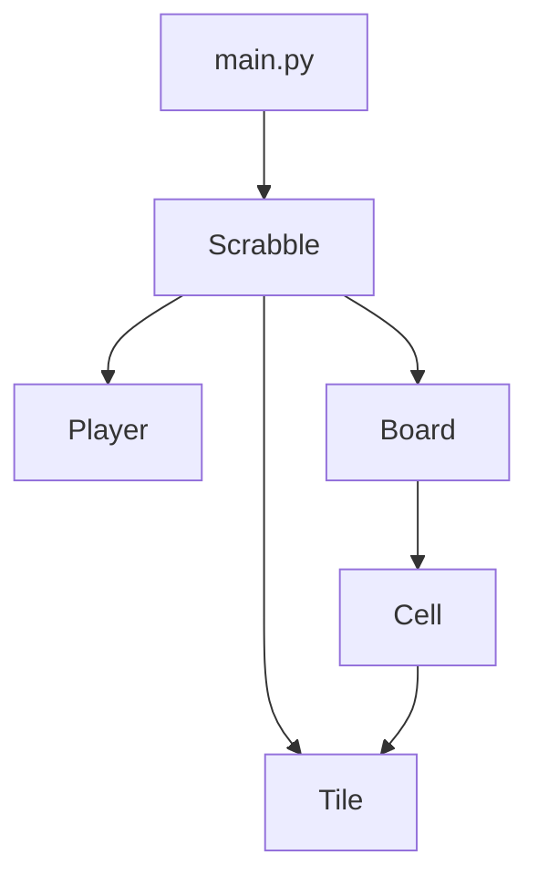

# The Scrabble Game
Scrabble is a word game in which two to four players score points by placing tiles, each bearing a single letter, onto a game board divided into a 15×15 grid of squares. The tiles must form words that, in crossword fashion, read left to right in rows or downward in columns and are included in a standard dictionary or lexicon.

## Rules

The Spanish-language games use these 100 tiles:

- 2 blank tiles (0 points)
- 1 point: A×12, E×12, O×9, I×6, S×6, N×5, L×4, R×5, U×5, T×4
- 2 points: D×5, G×2
- 3 points: C×4, B×2, M×2, P×2
- 4 points: H×2, F×1, V×1, Y×1
- 5 points: CH×1, Q×1
- 8 points: J×1, LL×1, Ñ×1, RR×1, X×1
- 10 points: Z×1

Prosodic accents are ignored. The letters K and W are not included since they are rarely used in Spanish words. According to the rules of FISE (Federación Internacional de Scrabble en Español), a blank tile cannot be used to represent K or W.

Using a C and an H tile in place of the CH tile, two L tiles for the LL tile, or two R tiles for the RR tile is also not allowed in Spanish Scrabble.

Spanish-language games sold within North America (known as Scrabble - Spanish Edition) use a different set of 103 tiles.

#### Complete guide of the rules of the game [here](https://service.mattel.com/instruction_sheets/51280.pdf)

## Download

```bash
git clone https://github.com/um-computacion-tm/scrabble-2023-EVAnci.git
```

## Running the game and coverage

You can run just the following:

```bash
bash play.sh
```

Or if you want to start it manually:

1. Build the image with a name:

```bash
docker build -t <nombre> .
```

2. Run the image:

```bash
docker run -it --name name_id -p 5000:5000 my_image_name:latest
```

This will also install all the dependences needed.

## Current Status

### *Unreleased*

See the [CHANGELOG](https://github.com/um-computacion-tm/scrabble-2023-EVAnci/blob/main/CHANGELOG.md) for more detail.

| *_CircleCI_* | *_Main branch_* | *_Develop branch_* |
| :---:   | :---:   | :---: |
| Status | [](https://dl.circleci.com/status-badge/redirect/gh/um-computacion-tm/scrabble-2023-EVAnci/tree/main) | [](https://dl.circleci.com/status-badge/redirect/gh/um-computacion-tm/scrabble-2023-EVAnci/tree/develop) |

| _*Codeclimate*_ | *_Coverage_* | *_Maintainability_* |
| :---:   | :---:   | :---: |
| Status | [](https://codeclimate.com/github/um-computacion-tm/scrabble-2023-EVAnci/test_coverage) | [](https://codeclimate.com/github/um-computacion-tm/scrabble-2023-EVAnci/maintainability) |

## Classes work flow

Here is a simple flow of classes communication:



## Sources
- The [Wikipedia (EN)](https://en.wikipedia.org/wiki/Scrabble)
- The [Wikipedia (ES)](https://es.wikipedia.org/wiki/Scrabble)

The game use a dictionary to validate the legitimacy of words, in case it's not found, uses a RAE API to check them. Words of less than one letter size were removed from the dictionary. Below is the page where I took the words I need and store in a file I create. This file is different because it has word with and without accents.

- The local [Dictionary](https://mausschool.com/vocabulario-en-espanol/) page source

## Student data

Universidad de Mendoza

Alumno: Anci V. Elio Valentino (62197)

Año 2023
